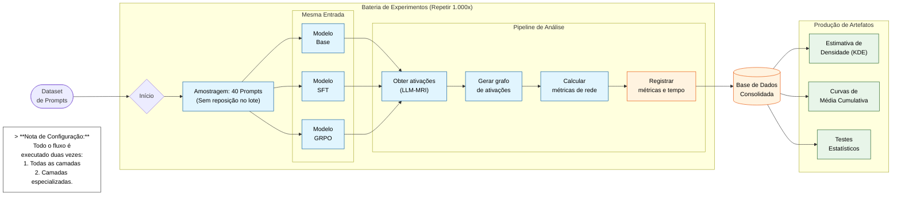

```mermaid
flowchart LR
    %% Estilos
    classDef container fill:#f9f9f9,stroke:#333,stroke-dasharray: 5 5;
    classDef process fill:#e1f5fe,stroke:#01579b,color:black;
    classDef artifact fill:#e8f5e9,stroke:#1b5e20,color:black;
    classDef data fill:#fff3e0,stroke:#e65100,color:black;

    %% Início
    Start([Dataset<br/>de Prompts]) --> LoopStart

    %% O Grande Loop
    subgraph ExperimentLoop ["Bateria de Experimentos (Repetir 1.000x)"]
        direction TB
        LoopStart{Início}
        
        Step1["Amostragem: 40 Prompts<br/>(Sem reposição no lote)"]:::process
        LoopStart --> Step1
        
        %% Paralelismo dos Modelos
        subgraph Models ["Mesma Entrada"]
            Model1[Modelo<br/>Base]:::process
            Model2[Modelo<br/>SFT]:::process
            Model3[Modelo<br/>GRPO]:::process
        end
        
        Step1 --> Model1
        Step1 --> Model2
        Step1 --> Model3

        %% Processamento
        subgraph Pipeline ["Pipeline de Análise"]
            Extract["Obter ativações<br/>(LLM-MRI)"]:::process
            Graph[Gerar grafo<br/>de ativações]:::process
            Metrics[Calcular<br/>métricas de rede]:::process
            Log[Registrar<br/>métricas e tempo]:::data
        end

        Model1 & Model2 & Model3 --> Extract
        Extract --> Graph --> Metrics --> Log
    end

    %% Saída
    Log --> OutputData[(Base de Dados<br/>Consolidada)]:::data
    
    %% Artefatos Finais
    subgraph Analysis ["Produção de Artefatos"]
        KDE["Estimativa de<br/>Densidade (KDE)"]:::artifact
        Curves[Curvas de<br/>Média Cumulativa]:::artifact
        Stats[Testes<br/>Estatísticos]:::artifact
    end

    OutputData --> KDE & Curves & Stats

    %% Nota Lateral
    note1[> **Nota de Configuração:**<br/>Todo o fluxo é<br/>executado duas vezes:<br/>1. Todas as camadas<br/>2. Camadas especializadas.] 
    
    style note1 fill:#fff,stroke:#333,stroke-width:1px,color:#000
```
